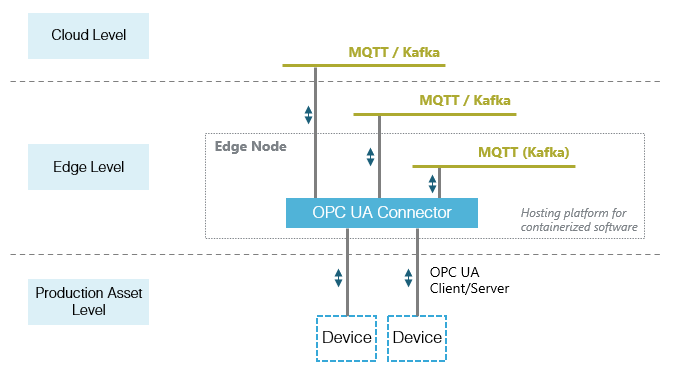
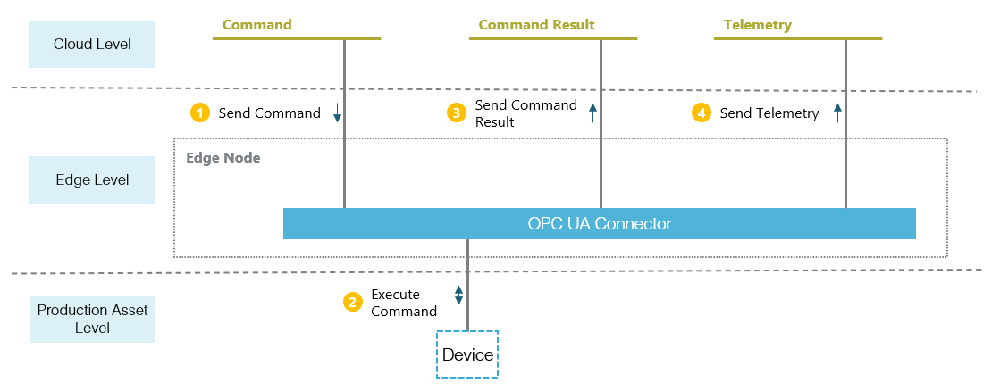

# OMP OPC UA Edge Connector 
### **Software under construction**

- [Motivation](#motivation)
- [Infrastructural View](#infrastructural-view)
- [Application View](#application-view)
- [Operational View](#operational-view)
- [Getting Started and Contribution](#getting-started-and-contribution)
- [Build and Installation](#build-and-installation)

## Introduction

- OPC UA is the major vendor independent machine protocol on production asset level
- IT systems don't have support for OPC UA, but follow streaming approaches
- There are currently no standalone, industrial-prove connectors for OPC UA available that convert OPC UA to a neutral format (e.g. MQTT or Kafka) and can be purely controlled by messages

That's why the OMP IoT Connectivity Working Group saw the need for a connector software, that is able to run on the edge level. The key OPC UA functionalities are supported according to the [OPC Foundation Specifications](https://opcfoundation.org/developer-tools/specifications-unified-architecture) and the OMP Edge standards are followed as defined in the [OMP White Paper](https://open-manufacturing.org/wp-content/uploads/sites/101/2021/07/OMP-IIoT-Connectivity-Edge-Computing-20210701.pdf). Both further OPC UA functionalities and new integration capabilities are to be added in a modular approach in the future. The focus on easy integrability and flexible extensibility is intended to encourage usage and collaboration. 

## Infrastructural View

The OPC UA Edge Connector is hosted on the Edge Level and can connect to the cloud level and the production asset level. Southbound to the production asset level it connects via the OPC UA Client/Server protocol. Northbound it connects to a message broker like MQTT or Kafka, which is in the cloud level or in the edge level, either on the same edge node for local processing of the data or centrally in the plant data center. The OPC UA connector is a containerized software and can run on an Edge Node like an industrial PC or a container platform.

## Application View

The OPC UA Edge Connector is controlled by messages. Therefor it consumes JSON messages from a command topic. After receiving a command, it executes an OPC UA operation against the OPC UA Server on an device (e.g. read/write/subscribe). The information about the success or failure of the operation is sent via the command result topic. 

A special function has the telemetry topic. Notifications of monitored items resulting from an active subscription are sent to the telemetry topic. 

## Operational View

In the configuration phase of the OPC UA Edge Connector a configuration needs to be applied. The configuration contains for example information about the message broker endpoints. The software is logging by default to the console. The user needs to bring a appropriate Monitoring Service and Management Service in place to be control, observe and operate the software centrally and in large scale.  

## Getting Started and Contribution

- Please check our documentation: (under construction)
- Share your thoughts with us in our [Discussion Board](https://github.com/OpenManufacturingPlatform/iotcon-opc-ua-connector-dotnet/discussions)
- You found a issue? Please create a [GitHub Issue](https://github.com/OpenManufacturingPlatform/iotcon-opc-ua-connector-dotnet/issues)

Please respect our contribution guidlines. (LINK)

## Build and Installation

- Please got the [MQTT Example](/readme-files/MQTTExample.md) to see how to build and run it.
- Please got the [Kafka Example](/readme-files/KafkaExample.md) to see how to build and run it.