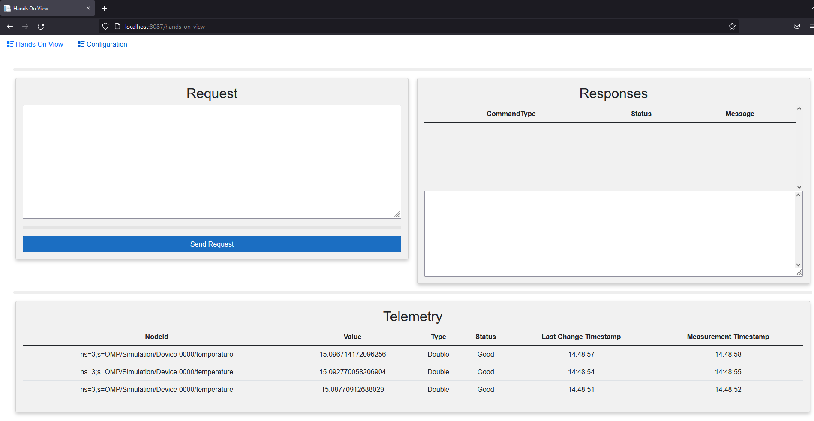

# OMP Hands on session for OPC UA Connector via MQTT

## How to Run

[Docker compose file](docker-compose.yaml)
  ```
  docker-compose up
  ```
  

## How to Test

Open your browser and navigate to http://localhost:8087/hands-on-view



Below is a list of commands that you can send over mqtt to the *Command* Topic of your choosing (same *Command* Topic that you configured in the connector prior to building).
- [Browse From Root Command](commands/browseFromRootCommand.json)
- [Browse Child Nodes Command](commands/browseChildNodesCommand.json)
- [Call Command](commands/callCommand.json)
- [Read Command](commands/readCommand.json)
- [Write Command](commands/writeCommand.json)
- [Create Subscription(s)](commands/createSubscriptionCommand.json)
- [Remove Subscription(s)](commands/removeSubscriptionCommand.json)
- [Remove All Subscriptions](commands/removeAllSubscriptionsCommand.json)
