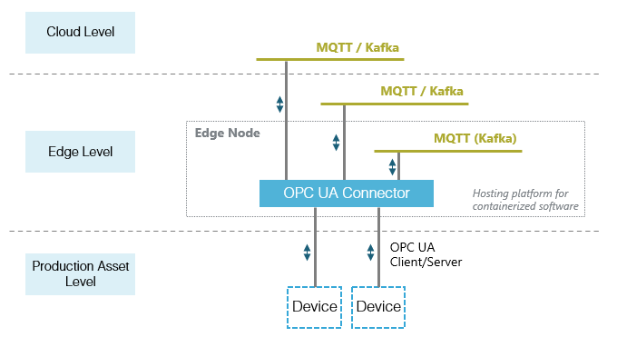

# OMP OPC UA Connector via MQTT

The **OMP OPC UA Connecotr** via (reffered to as the **Connector**) **MQTT** provides a mechanism to interact with **OPC UA Server(s)** over **MQTT**, wihtout having to implement the OPC UA protocol. The **Connector** allows you to:
- *Subscribe* to telemery message on nodes
- Do *Read* opperations on nodes
- Do *Write* opperations on nodes
- Do *Call* opperations on nodes
- Browse nodes
- ...and more

In this document we intend to provide a guide to *Configure*, *Build*, *Run* and *Test* an generic implementation vir **MQTT**

## Index

- [Prerequisites](#prerequisites)
- [How to Configure](#how-to-configure)
- [How to Run](#how-to-run)
- [How to Test](#how-to-test)


## Prerequisites
- Docker - To Build and run the Connector via Docker
- OPC UA Server
- MQTT Broker

---
## How to Configure the Connector

**Verry important**: An example settings file is provided **moduleSettings.example.json** (/samples/MqttSample/moduleSettings.example.json). Please copy the file and change the name to **moduleSettings.json** (/samples/MqttSample/moduleSettings.json). Change any and all settings to suite your environment here.

###  Understanding how the *Connector's* Configuration works
To understand how the connector's configuration works it is important to understant how/where the Connector gets commands and send response/telemetry to-and-from the outside world.

| Endpoint        | Description   |
| ------------- | ------------- |
| Command | This is the endpoint (MQTT Topic) where the outside world can send commands to the *Connector*  |
| Response | This is the endpoint (MQTT Topic) where the *Connector* will send the Result of commands back  |
| Telemetry | This is the endpoint (MQTT Topic) where the *Connector* will publish telemetry message  |

Then the configuration file has a couple of sections but for MQTT we will focus on the *Communication* section. 
Under *Communication* there are 4 sub sections of importance
- Shared
```json
 {
  ...,
  "Communication": {    
    "Shared": {
      "Type": "mqtt",
       ...
```
In an attempt to not bloat the settings file the *Shared* section is there to share basic MQTT settings (e.g Username, Password,..) between different endpoints, if the same **MQTT Broker** is used accross the endpoints (Topics).

**Note**: Shared settings are read and applied first (1st) subsequent section will override Shared settings. Meaning if you set the brokerAddress in Shared to 'Broker-Shared'. And in the CommandEndpoint section (Under NativeSettings) you set the brokerAddress to 'Broker-Command' then, when the *Connector* instatiates the CommandEndpoint it will set the brokerAddress to 'Broker-Command' and not 'Broker-Shared'.

- Command Endpoint
```json
 {
  ...,
  "CommandEndpoint": {
      "Type": "mqtt",
      "NativeSettings": {
        "topics": [
          {
            "topicName": "commands",
            "qosLevel": 1,
            "retain": false
          }
        ]
      }
        ...
```
This is where we specify what Topic, QoS Level and any other setting specific to the *Command Endpoint*

- Response Endpoint
```json
 {
  ...,
  "ResponseEndpoint": {
      "Type": "mqtt",
      "NativeSettings": {
        "topics": [
          {
            "topicName": "responses",
            "qosLevel": 1,
            "retain": false
          }
        ]
      }
        ...
```
This is where we specify what Topic, QoS Level and any other setting specific to the *Response Endpoint*

- Telemetry Endpoint
```json
{
  ...,
    "TelemetryEndpoint": {
      "Type": "mqtt",
      "NativeSettings": {
        "topics": [
          {
            "topicName": "telemetry",
            "qosLevel": 1,
            "retain": false
          }
        ]
      }
        ...
```

This is where we specify what Topic, QoS Level and any other setting specific to the *Telemetry Endpoint*

### Complete example of the *Communication* section in the settigns file:

```json
 {
  ...,
  "Communication": {
    "SchemaUrl": "https://someSchemaStore.com/schemas/",
    "Shared": {
      "Type": "mqtt",
      "NativeSettings": {
        "brokerAddress": "localhost",
        "brokerPort": "1883",
        "username": "test",
        "password": "test",
        "clientId": null,
        "secure": false,
        "caCertData": null,
        "clientCaCertData": null,
        "ignoreCertificateValidation": false,
        "cleanSession": true,
        "willFlag": false,
        "willQosLevel": 0,
        "willTopic": null,
        "willMessage": null,
        "willRetain": false,
        "keepAlivePeriod": 60,
        "autoReconnectTimeInSeconds": 10,
        "sslProtocols": "None",
        "protocolVersion": "Version_3_1"
      }
    },
    "TelemetryEndpoint": {
      "Type": "mqtt",
      "NativeSettings": {
        "topics": [
          {
            "topicName": "telemetry",
            "qosLevel": 1,
            "retain": false
          }
        ]
      }
    },
    "CommandEndpoint": {
      "Type": "mqtt",
      "NativeSettings": {
        "topics": [
          {
            "topicName": "commands",
            "qosLevel": 1,
            "retain": false
          }
        ]
      }
    },
    "ResponseEndpoint": {
      "Type": "mqtt",
      "NativeSettings": {
        "topics": [
          {
            "topicName": "responses",
            "qosLevel": 1,
            "retain": false
          }
        ]
      }
    }
  },
  "Persistance": {
    "Type": "inMemory",
    "NativeSettings": {
    }
  }
}
```
---

###  How to configure MQTT
Internally we use a 3rd party package to handle the specifics of the MQTT ([M2MqttDotnetCore](https://github.com/mohaqeq/paho.mqtt.m2mqtt)) protocol.

#### NativeSettings
  ```json
  In NativeSettings is where you can set all the MQTT specific settings that the M2MqttDotnetCore exposes
  Below is a list of such settings (Note: These are commen settings but it is not meant to be an exaustive list)

 {
  ...,
  "Communication": {
    "Shared": {
      "Type": "mqtt",
      "NativeSettings": {
        "brokerAddress": "localhost",
        "brokerPort": "1883",
        "username": "test",
        "password": "test",
        "clientId": null,
        "secure": false,
        "caCertData": null,
        "clientCaCertData": null,
        "ignoreCertificateValidation": false,
        "cleanSession": true,
        "willFlag": false,
        "willQosLevel": 0,
        "willTopic": null,
        "willMessage": null,
        "willRetain": false,
        "keepAlivePeriod": 60,
        "autoReconnectTimeInSeconds": 10,
        "sslProtocols": "None",
        "protocolVersion": "Version_3_1"
      }
    },
   ...
}
```
---

## How to Run
- MQTT

##### Docker Build
  ```
  docker build -t mqqtTest1 -f Dockerfile.MqttSample .
  ```

## How to Test
-Message Models


### **Software under construction**

- [Motivation](#motivation)
- [Infrastructural View](#infrastructural-view)
- [Application View](#application-view)
- [Operational View](#operational-view)
- [Getting Started and Contribution](#getting-started-and-contribution)
- [Build and Installation](#build-and-installation)


## Introduction

- OPC UA is the major vendor independent machine protocol on production asset level
- IT systems don't have support for OPC UA, but follow streaming approaches
- There are currently no standalone, industrial-prove connectors for OPC UA available that convert OPC UA to a neutral format (e.g. MQTT or Kafka) and can be purely controlled by messages

That's why the OMP IoT Connectivity Working Group saw the need for a connector software, that is able to run on the edge level. The key OPC UA functionalities are supported according to the [OPC Foundation Specifications](https://opcfoundation.org/developer-tools/specifications-unified-architecture) and the OMP Edge standards are followed as defined in the [OMP White Paper](https://open-manufacturing.org/wp-content/uploads/sites/101/2021/07/OMP-IIoT-Connectivity-Edge-Computing-20210701.pdf). Both further OPC UA functionalities and new integration capabilities are to be added in a modular approach in the future. The focus on easy integrability and flexible extensibility is intended to encourage usage and collaboration. 


## Infrastructural View

The OPC UA Edge Connector is hosted on the Edge Level and can connect to the cloud level and the production asset level. Southbound to the production asset level it connects via the OPC UA Client/Server protocol. Northbound it connects to a message broker like MQTT or Kafka, which is in the cloud level or in the edge level, either on the same edge node for local processing of the data or centrally in the plant data center. The OPC UA connector is a containerized software and can run on an Edge Node like an industrial PC or a container platform.



## Application View

The OPC UA Edge Connector is controlled by messages. Therefor it consumes JSON messages from a command topic. After receiving a command, it executes an OPC UA operation against the OPC UA Server on an device (e.g. read/write/subscribe). The information about the success or failure of the operation is sent via the command result topic. 

A special function has the telemetry topic. Notifications of monitored items resulting from an active subscription are sent to the telemetry topic. 


## Operational View

In the configuration phase of the OPC UA Edge Connector a configuration needs to be applied. The configuration contains for example information about the message broker endpoints. The software is logging by default to the console. The user needs to bring a appropriate Monitoring Service and Management Service in place to be control, observe and operate the software centrally and in large scale.  


## Getting Started and Contribution

- Please check our documentation: (under construction)
- Share your thoughts with us in our [Discussion Board](https://github.com/OpenManufacturingPlatform/iotcon-opc-ua-connector-dotnet/discussions)
- You found a issue? Please create a [GitHub Issue](https://github.com/OpenManufacturingPlatform/iotcon-opc-ua-connector-dotnet/issues)

Please respect our contribution guidlines. (LINK)

## Build and Installation